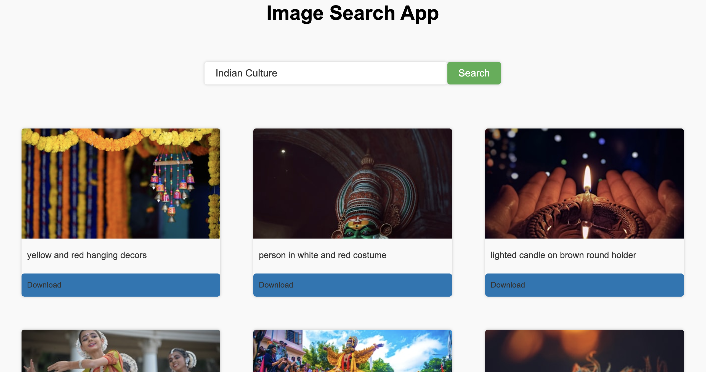

# Image Search App

The **Image Search App** is a simple and interactive web application that allows users to search for images using the Unsplash API. Users can view the search results, visit the image source, and download the images directly.

## Live Preview

You can try the app live [here](#).

## Features

- Search for high-quality images using the Unsplash API.
- View search results in a responsive grid layout.
- Visit the source of the image on Unsplash.
- Download images directly with a single click.
- Load more results with the "Show More" button.

## Screenshots

**Search Interface**

## Technologies Used

- **HTML**: For structuring the application.
- **CSS**: For styling and responsive design.
- **JavaScript**: For handling API requests and interactivity.
- **Unsplash API**: For fetching high-quality images.

## How to Use

1. Enter a keyword in the search bar (e.g., "nature", "cars", "technology").
2. Click the **Search** button to fetch images related to the keyword.
3. Browse the results displayed in a grid layout.
4. Click the **Download** button below an image to download it.
5. Use the **Show More** button to load additional results.

## Project Structure
Image Search App/ ├── index.html # Main HTML file ├── style.css # Stylesheet for the app ├── index.js # JavaScript file for app logic ├── assets/ # Folder containing screenshots and other assets └── readme.md # Project documentation

## How to Run the Project

1. Clone the repository or download the project files.
2. Open the `index.html` file in your browser.
3. Start searching for images!

## Future Improvements

- Add pagination for better navigation through results.
- Implement a lightbox feature to preview images in full size.
- Allow users to select image resolution before downloading.
- Add a favorites feature to save images for later.

## License

This project is open-source and available under the [MIT License](https://opensource.org/licenses/MIT).

---
Enjoy searching for beautiful images!